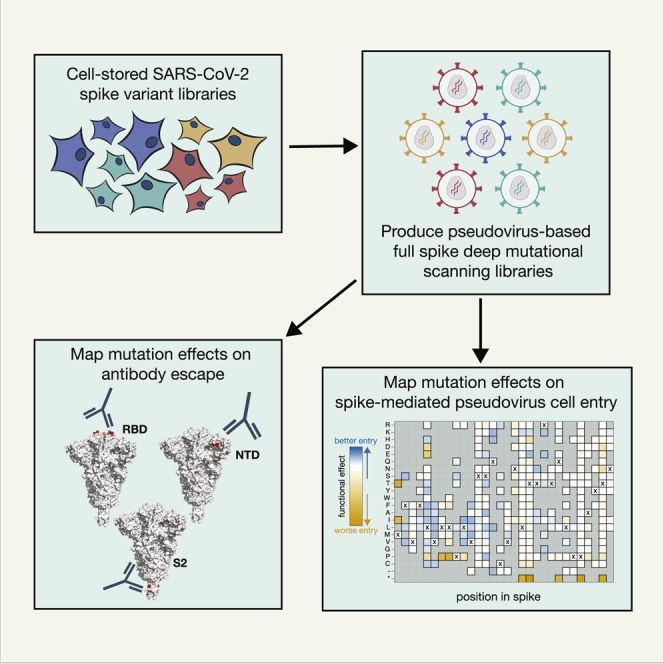

In [a new study](https://doi.org/10.1101/2024.05.23.595634), we have generated information that can help with surveillance of the ongoing evolution of clade 2.3.4.4b influenza viruses that are thought to pose a potential pandemic risk.

---

## Summary of our study

See also [Jesse's Twitter thread](https://x.com/jbloom_lab/status/1794364494858346803) and [some slides about the study](https://slides.com/jbloom/h5-dms-short).

## How to visualize and access the data
A key goal of our study is to make the data as easily available as possible, to facilitate its use by other studying H5 influenza evolution.

We have made an [interactive page](https://dms-vep.org/Flu_H5_American-Wigeon_South-Carolina_2021-H5N1_DMS/) that allows you to visually examine heatmaps showing the effects of all the mutations on each measured phenotype.
We've also made an [interactive structure-based visualization](https://dms-viz.github.io/v0/?data=https%3A%2F%2Fraw.githubusercontent.com%2Fdms-vep%2FFlu_H5_American-Wigeon_South-Carolina_2021-H5N1_DMS%2Fmain%2Fresults%2Fdms-viz%2Fdms-viz.json), and you can [obtain the numerical data here](https://github.com/dms-vep/Flu_H5_American-Wigeon_South-Carolina_2021-H5N1_DMS/blob/main/results/summaries/phenotypes.csv).

Note that there are multiple HA numbering schemes in use, so make sure [you understand how the mutations are being numbered](https://dms-vep.org/Flu_H5_American-Wigeon_South-Carolina_2021-H5N1_DMS/numbering.html).

## Examples of how the data are being used

