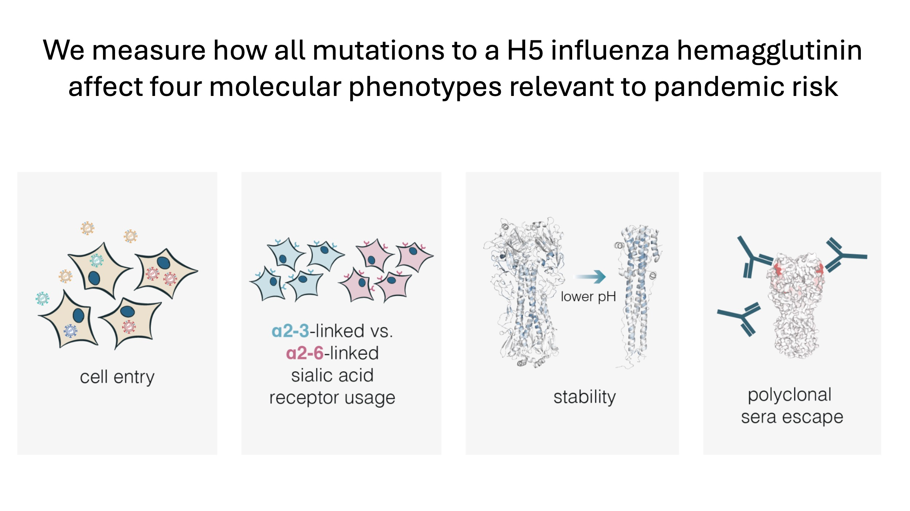

In [a new study](https://doi.org/10.1101/2024.05.23.595634), we have measured how all mutations to the hemagglutinin (HA) of clade 2.3.4.4b H5 influenza affect molecular phenotypes relevant to pandemic risk.

---

## Overview

H5 influenza from clade 2.3.4.4b [has been causing](https://wwwnc.cdc.gov/eid/article/30/7/24-0508_article) outbreaks in numerous animals, including wild birds, poultry, cats, and cattle.
There is concern that this virus could pose a potential risk to humans if it acquires additional mutations that improve its ability to infect or transmit in humans.
From prior work, several molecular phenotypes of HA are known to contribute to pandemic risk.
In this study, we used deep mutational scanning to measure how all HA amino-acid mutations affected key molecular phenotypes.

See also [Jesse's Twitter thread](https://x.com/jbloom_lab/status/1794364494858346803) and [some slides about the study](https://slides.com/jbloom/h5-dms-short).

## How to visualize and access the data
To make the data as accessible as possible for use by others, we have

- Made an [interactive page](https://dms-vep.org/Flu_H5_American-Wigeon_South-Carolina_2021-H5N1_DMS/) that allows you to visually examine heatmaps showing the effects of all the mutations on each measured phenotype.

- Made an [interactive structure-based visualization](https://dms-viz.github.io/v0/?data=https%3A%2F%2Fraw.githubusercontent.com%2Fdms-vep%2FFlu_H5_American-Wigeon_South-Carolina_2021-H5N1_DMS%2Fmain%2Fresults%2Fdms-viz%2Fdms-viz.json)

- Made the [numerical values of the measurements](https://github.com/dms-vep/Flu_H5_American-Wigeon_South-Carolina_2021-H5N1_DMS/blob/main/results/summaries/phenotypes.csv) available.

- Note that there are multiple HA numbering schemes in use, so make sure [you understand how the mutations are being numbered](https://dms-vep.org/Flu_H5_American-Wigeon_South-Carolina_2021-H5N1_DMS/numbering.html).

## Examples of how the data are being used

